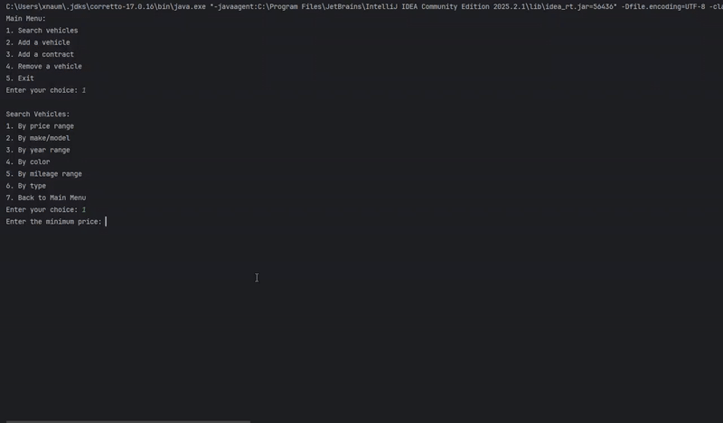
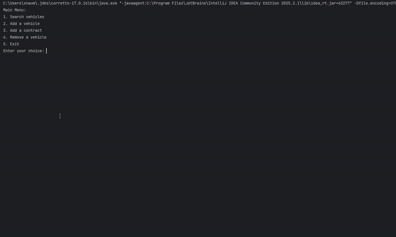
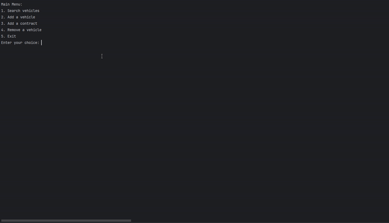
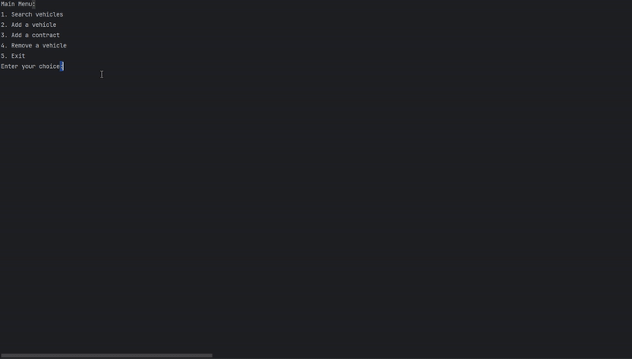

# Car Dealership Management System (JDBC)

## Description of the Project
This Java console application simulates a dealership management system with database persistence using JDBC. Building off an older CSV-based version, 
this version leverages MySQL to store vehicles, sales contracts, lease contracts, and dealership inventory. 

## User Stories
- As a user, I want to search for vehicles by various criteria so that I can help customers find the right vehicle. 
- As a user, I want to add and remove vehicles from the database so that the inventory stays up to date. 
- As a user, I want to record sales contracts so that we have accurate records of all vehicle sales. 
- As a user, I want to record lease contracts with monthly payment information so that customers can have flexible payment options. 
- As a user, I want to manage dealership inventory so that vehicles are properly associated with specific dealership locations.

## Setup
Instructions on how to set up and run the project using IntelliJ IDEA.

### Prerequisites
- IntelliJ IDEA: Ensure you have IntelliJ IDEA installed, which you can download from [here](https://www.jetbrains.com/idea/download/).
- Java SDK: Make sure Java SDK 17 or higher is installed and configured in IntelliJ.
- MySQL: Install MySQL Server 8.0+ and have it running locally.

### Running the Application in IntelliJ
Follow these steps to get your application running within IntelliJ IDEA:

1. Open IntelliJ IDEA.
2. Select "Open" and navigate to the directory where you cloned or downloaded the project.
3. After the project opens, wait for IntelliJ to index the files and set up the project.
4. Find the main class: `src/main/java/com/yearup/dealership/Main/Main.java`
5. Right-click on the file and select 'Run Main.main()' to start the application.

## Technologies Used
- Java 17: openjdk 17.0.12 2024-07-16
- MySQL 8.0

## Demo

### Search Vehicles

### Add Vehicle

### Add Contract

### Remove Vehicle

## Future Work
- Add update functionality for existing vehicles.
- Implement sales statistics from different years/months. 

## Thanks
Thank you to Raymond for continuous support and guidance throughout this project.
